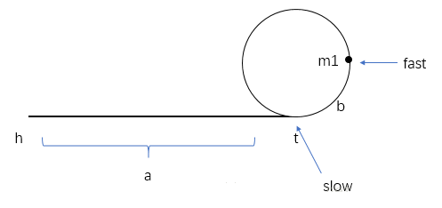
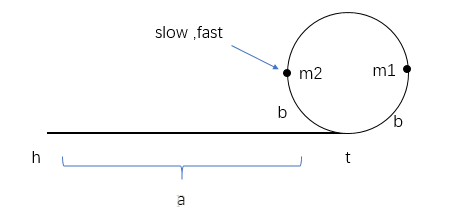

## 题目描述

一个链表中包含环，请找出该链表的环的入口结点

## 解题思路


举一反三：

1. 判断有环的存在
   1. 可以用两个速度不同的指针[fast](https://www.baidu.com/s?wd=fast&tn=24004469_oem_dg&rsv_dl=gh_pl_sl_csd)、slow从同一地点出发，如果相遇则证明存在环，若fast指向NULL，则不存在环

2. 找到环的入口结点

   1. 在问题一中两指针相遇后，让一个指针从头结点开始，另一个从相遇结点开始，并以相同速度向后指，再次相遇时就是环的入口结点。

   2. 证明：

      1. 假设存在环，fast以速度2运行，slow以速度1运行，在slow走到入口t时，如图（m1为在slow首次到t时fast的位置，a为h到t的距离，b为t到m1的距离，n为环的周长）： 

         

      2. 由图知fast走的距离为`a+b+xn`，slow走的距离为`a`，又`v(fast) = 2*v(slow)`，所以`x(fast) = 2*x(slow)`，即`2a = a+b+xn`，因此`a = b+xn`。 
         m1逆时针到t的距离为n-b。

      3. 在首次相遇时，如图（m2为相遇点）： 由于m1逆时针到t的距离为n-b，即要达到相遇需要追赶`n-b`的距离，由于两者速度差为1，因此需要`n-b`的时间才能相遇，此时slow再次向后n-b距离，即到达m2位置与fast相遇，因为一周长度为n，因此到t的距离为 `n-(n-b) = b`。

         

      4. 为何令slow重新从pHead以速度1开始走，令fast从m2以速度1走？要想在入口t相遇，则需要从m2处再走`b+xn`的距离，刚好pHead处符合（由1)可知），所以令slow从pHead开始走。在相遇后就是入口t的位置。

3. 找出环中任意一个节点

   1. 调用问题二的函数，求出环的入口,然后走n步长。

4. 得到环中节点的数目

   1. 调用问题二的函数，求出环的入口，然后让`ptr_1`走到环的入口，然后让`ptr_1`再次走到环的入口，统计下路程，就是环长。

      ```Java
      ListNode enterNode = EntryNodeOfLoop(pHead);
      int ret = 0;
      do {
          ++ret;
      } while ((ptr = ptr.next) != enterNode);
      return ret;
      ```

      


## 代码

```java
public class Test22{
	public ListNode EntryNodeOfLoop(ListNode pHead)
    {
        if(pHead == null || pHead.next == null)
    	   return null;
       ListNode fast = pHead;//快指针每次走两步
       ListNode slow = pHead;//每次走一步
       while(fast!=null && fast.next !=null)//因为fast每次要走两步，所有需要判断fast的下一个是否为空
       {
    	   slow = slow.next;
    	   fast = fast.next.next;
    	   //判断是否相遇 相遇后让快指针从头开始走，每次都是走一步，第二次相遇的节点就是环的入口
    	   if(fast.val == slow.val)
    	   {
               //证明有环
    		  fast = pHead;
    		  while(fast.val != slow.val)
    		  {
    			  fast = fast.next;
    			  slow = slow.next;
    		  }
    	   }
    	   if(fast.val == slow.val)
    	   {
    		   return slow;
    	   }
       }
       return null;//要是没有相遇，此链表没有环返回空
    }
}
```


