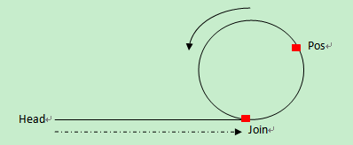

## 题目描述

一个链表中包含环，请找出该链表的环的入口结点

## 解题思路


举一反三：

1. 判断有环的存在(<span style="color: #ff0000;">追击相遇问题</span>)

   

   使用两个slow, fast指针从头开始扫描链表。<span style="color: #ff0000;"><strong>指针slow 每次走1步，指针fast每次走2步。如果存在环，则指针slow、fast会相遇</strong></span>；如果不存在环，指针fast遇到NULL退出。

2. **求有环单链表的环长**

   <p>&nbsp;　　在环上相遇后，记录第一次相遇点为Pos，之后指针slow继续每次走1步，fast每次走2步。<strong><span style="color: #ff0000;">在下次相遇的时候fast比slow正好又多走了一圈，也就是多走的距离等于环长。</span></strong></p>

   <p>　　设从第一次相遇到第二次相遇，设slow走了len步，则fast走了2*len步，相遇时多走了一圈：</p>

   <p>　　　　环长=2*len-len。</p>

3. 找到环的入口结点（求LenA长度）

   1. <span style="color: #ff0000;">第一次碰撞点Pos到连接点Join的距离=头指针到连接点Join的距离</span>，因此，分别从第一次碰撞点Pos、头指针head开始走，相遇的那个点就是连接点。

   2. 证明：

      1. <p>在环上相遇后，记录第一次相遇点为Pos，连接点为Join，假设头结点到连接点的长度为<strong>LenA</strong>，连接点到第一次相遇点的长度为<strong>x</strong>，环长为<strong>R</strong>。</p>

      

      由图知，第一次相遇时，

      slow走S = LenA + x

      fast走2S = LenA + x + n*R

      <p><span>所以可以知道，<strong>LenA</strong>&nbsp;+&nbsp;<strong>x =&nbsp;</strong>&nbsp;n*<strong>R</strong>;　　<strong>LenA = n*R -x;</strong></span></p>

      

4. 找出环中任意一个节点
   1. 调用问题3的函数，求出环的入口,然后走n步长。

5. **求有环单链表的链表长**
   1. 上述2中求出了环的**长度**；3中求出了**连接点的位置**，就可以求出头结点到连接点的长度。两者**相加**就是链表的长度。


## 代码

```java
//2.求有环单链表的环长
int getRingLength(LinkNode *ringMeetNode){
    int RingLength=0;
    LinkNode *fast = ringMeetNode;
    LinkNode *slow = ringMeetNode;
    for(;;){
        fast = fast->next->next;
        slow = slow->next;
        RingLength++;
        if(fast == slow)
            break;
    }
    return RingLength;
}

//3.找到环的入口结点
public class Test22{
	public ListNode EntryNodeOfLoop(ListNode pHead)
    {
        if(pHead == null || pHead.next == null)
    	   return null;
       ListNode fast = pHead;//快指针每次走两步
       ListNode slow = pHead;//每次走一步
       while(fast!=null && fast.next !=null)//因为fast每次要走两步，所有需要判断fast的下一个是否为空
       {
    	   slow = slow.next;
    	   fast = fast.next.next;
    	   //判断是否相遇 相遇后让快指针从头开始走，每次都是走一步，第二次相遇的节点就是环的入口
    	   if(fast.val == slow.val)
    	   {
               //证明有环
    		  fast = pHead;
    		  while(fast.val != slow.val)
    		  {
    			  fast = fast.next;
    			  slow = slow.next;
    		  }
    	   }
    	   if(fast.val == slow.val)
    	   {
    		   return slow;
    	   }
       }
       return null;//要是没有相遇，此链表没有环返回空
    }
}
```


